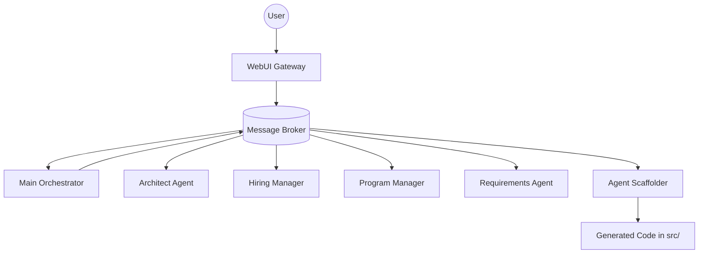
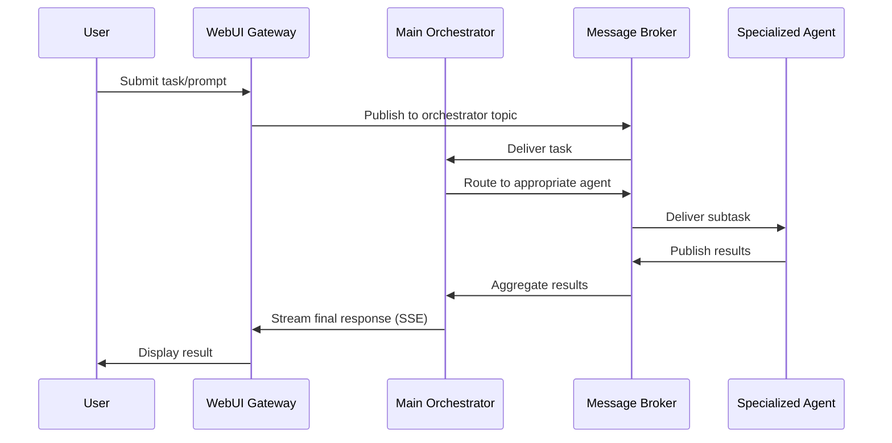

# WARP.md

This file provides guidance to WARP (warp.dev) when working with code in this repository.

# Unslop: Agentic Company Orchestrator

Unslop is a multi-agent AI system built on the Solace Agent Mesh (SAM) framework. It functions as a "glorified agent mesh based MCP client" that orchestrates specialized AI agents to handle complex business workflows like architecture planning, hiring management, and program coordination.

## Quick Start

### Prerequisites
- Python 3.11 or newer
- Git
- Docker (for message broker)
- Virtual environment support (`venv` or equivalent)

### Setup and Run
```bash
# Clone and setup
git clone <repository-url>
cd unslop

# Create virtual environment
python3 -m venv .venv
source .venv/bin/activate  # On Windows: .venv\Scripts\activate

# Install dependencies
python -m pip install --upgrade pip
pip install -r requirements.txt

# Initialize and run
sam init --gui
sam run
```

The WebUI will be available at: http://127.0.0.1:8000

## Development Commands

### Environment Setup
```bash
# Create and activate virtual environment
python3 -m venv .venv
source .venv/bin/activate

# Install dependencies
python -m pip install --upgrade pip
pip install -r requirements.txt
```

### Running the System
```bash
# Initialize SAM configuration (first time only)
sam init --gui

# Start the complete agent mesh
sam run

# Alternative: Run components individually
# (Note: SAM typically manages all agents through sam run)
```

### Testing
The repository doesn't currently include a formal test suite. Testing is typically done through:
- Direct interaction with the WebUI at http://127.0.0.1:8000
- Agent-to-agent communication via the message broker
- Manual validation of agent responses

## Architecture Overview

Unslop implements a distributed agent architecture using Solace Agent Mesh as the communication backbone:



### Request Flow


## Key Components

### Main Orchestrator Agent (`configs/agents/main_orchestrator.yaml`)
- **Purpose**: Central coordination and task routing
- **Responsibilities**: 
  - Process tasks from the WebUI Gateway
  - Determine optimal execution strategy (single agent vs. multi-agent coordination)
  - Manage artifact lifecycle and return important artifacts to users
- **Model**: Uses planning model (gemini-2.5-pro)
- **Tools**: Artifact management, data analysis

### Agent Scaffolder (`configs/agents/agent_scaffolder.yaml`)
- **Purpose**: Dynamic agent and tool generation
- **Key Function**: `define_dynamic_tools` in `src/agent_scaffolder/tools.py`
- **Capabilities**:
  - Generate new agent YAML configurations
  - Create tool stub implementations in `src/<agent_name>/tools.py`
  - Automatic code generation with proper imports and documentation
- **Output**: Creates agents in `configs/agents/` and tools in `src/`

### Specialized Agents
- **Architect Agent**: Solution architecture planning and technical design
- **Hiring Manager**: Job descriptions and candidate screening workflows
- **Program Manager**: Project coordination and milestone management
- **Requirements Agent**: Requirements gathering and analysis

### WebUI Gateway (`configs/gateways/webui.yaml`)
- **Framework**: FastAPI with Server-Sent Events (SSE)
- **Default Port**: 8000 (configurable via `FASTAPI_PORT`)
- **Features**: CORS support, artifact management, real-time streaming
- **Purpose**: HTTP/WebSocket bridge to the agent mesh

## Configuration System

### Directory Structure
```
configs/
├── shared_config.yaml        # Common settings (models, broker, services)
├── logging_config.ini        # Log configuration
├── agents/                   # Agent definitions
│   ├── main_orchestrator.yaml
│   ├── agent_scaffolder.yaml
│   ├── architect_agent.yaml
│   ├── hiring_manager.yaml
│   ├── program_manager_agent.yaml
│   └── requirements_agent.yaml
└── gateways/
    └── webui.yaml           # WebUI gateway config
```

### Key Configuration Elements

#### Shared Configuration (`configs/shared_config.yaml`)
- **Broker Connection**: WebSocket connection to Solace PubSub+ (default: `ws://localhost:8080`)
- **Model Selection**: 
  - Planning model: `gemini-2.5-pro`
  - General model: `gemini-2.5-pro` 
  - Multimodal model: `gemini-2.5-flash-preview-04-17`
- **Services**: Memory-based sessions, filesystem-based artifacts

#### Environment Variables
```bash
# Core Configuration
NAMESPACE=your_namespace
SOLACE_BROKER_URL=ws://localhost:8080
SOLACE_BROKER_USERNAME=default
SOLACE_BROKER_PASSWORD=default
SOLACE_BROKER_VPN=default

# WebUI Gateway
FASTAPI_HOST=127.0.0.1
FASTAPI_PORT=8000
SESSION_SECRET_KEY=your_secret_key
WEBUI_GATEWAY_ID=your_gateway_id

# Model Provider (configure as needed)
LLM_SERVICE_ENDPOINT=your_endpoint
LLM_SERVICE_API_KEY=your_api_key
MODEL_NAME=gemini-2.5-pro
```

## Agent Development Workflow

### 1. Using the Agent Scaffolder
The Agent Scaffolder can dynamically create new agents:

```python
# Example tool call to scaffolder agent
{
    "agent_name": "CustomAgent",
    "tools": [
        {
            "function_name": "process_data",
            "description": "Process incoming data",
            "params": [
                {"name": "data", "type": "str", "description": "Input data"}
            ],
            "returns": {"type": "dict", "description": "Processed result"}
        }
    ]
}
```

### 2. Manual Agent Creation

1. **Create Agent YAML** in `configs/agents/`:
```yaml
!include ../shared_config.yaml

apps:
  - name: custom_agent
    app_module: solace_agent_mesh.agent.sac.app
    broker:
      <<: *broker_connection
    app_config:
      namespace: "${NAMESPACE}"
      agent_name: "CustomAgent"
      model: *general_model
      instruction: |
        Your agent instructions here...
      tools:
        - tool_type: python
          component_module: "src.custom_agent.tools"
          function_name: "your_function"
```

2. **Implement Tools** in `src/custom_agent/tools.py`:
```python
from solace_ai_connector.common.log import log

async def your_function(param1: str, tool_context=None, tool_config=None) -> dict:
    """Your tool implementation"""
    log.info("[your_function] called")
    # Implementation here
    return {"status": "success", "result": "processed"}
```

### 3. Agent Registration
Agents are automatically discovered by the SAM framework when their YAML files are present in `configs/agents/`.

## Message Broker Setup

### Default: Solace PubSub+ Standard (Recommended)
```bash
# Start Solace PubSub+ broker
docker run -d --name solace \
  -p 8080:8080 -p 55555:55555 -p 8008:8008 -p 1883:1883 -p 5672:5672 \
  -e username_admin_globalaccesslevel=admin -e username_admin_password=admin \
  solace/solace-pubsub-standard

# Verify broker is running
curl http://localhost:8008/health-check/guaranteed-active
```

### Alternative: NATS
```bash
docker run -d --name nats -p 4222:4222 -p 8222:8222 nats:latest
```

### Broker Configuration
- **Connection**: WebSocket on port 8080
- **Management**: HTTP on port 8008
- **Default Credentials**: admin/admin
- **VPN**: default

## Repository Structure

```
unslop/
├── README.md
├── requirements.txt
├── configs/
│   ├── shared_config.yaml     # Global SAM configuration
│   ├── logging_config.ini     # Logging setup
│   ├── agents/               # Agent definitions
│   └── gateways/             # Gateway configurations
├── src/
│   ├── agent_scaffolder/     # Dynamic agent generation
│   ├── contentcreationagent/ # Generated agent example
│   ├── grocery_agent/        # Generated agent example
│   └── __init__.py
├── .venv/                    # Virtual environment
└── *.log                     # Application logs
```

## Troubleshooting

### Common Issues

1. **Broker Connection Failed**
   - Verify Docker container is running: `docker ps`
   - Check broker health: `curl http://localhost:8008/health-check/guaranteed-active`
   - Verify environment variables match broker configuration

2. **WebUI Not Loading**
   - Check if port 8000 is available
   - Verify `sam run` completed successfully
   - Check logs in `webui_app.log`

3. **Agent Not Responding**
   - Check agent YAML syntax in `configs/agents/`
   - Verify agent tools are properly implemented
   - Check logs for import errors or missing dependencies

4. **Model Provider Issues**
   - Ensure proper API keys are configured
   - Check model names match provider specifications
   - Verify network connectivity to model endpoints

### Logging
- **Location**: Individual log files per component (`sam.log`, `webui_app.log`, etc.)
- **Configuration**: `configs/logging_config.ini`
- **Log Rotation**: Automatic (50MB files, 10 backups)
- **Debug Level**: Set via environment or config files

### Development Tips

1. **Adding New Tools**: Use the Agent Scaffolder for consistency
2. **Testing Agents**: Interact directly through WebUI for rapid iteration
3. **Configuration Changes**: Restart `sam run` after modifying YAML files
4. **Debugging**: Check individual log files for component-specific issues

## Integration with Solace Agent Mesh

This system leverages SAM's core features:
- **Agent Discovery**: Automatic registration and discovery of agents
- **Message Routing**: Topic-based communication between agents
- **Session Management**: Persistent conversation state
- **Artifact Handling**: File and data artifact management
- **Tool Integration**: Python-based tool execution framework

For more details on SAM concepts and advanced configuration, refer to the Solace Agent Mesh documentation.
